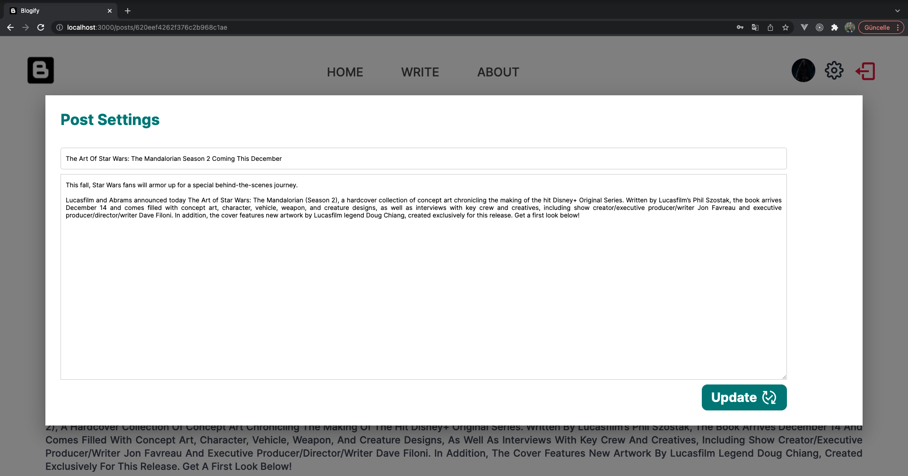

# MERN Blog App 👩‍💻 🚀

## Built With 🔨
<ul>
<li>
<a target="_blank" href="https://www.mongodb.com/atlas/database">MongoDB</a>
</li>    
<li>
<a target="_blank" href="https://expressjs.com/">Express.js</a>
</li>   
<li>
<a target="_blank" href="https://reactjs.org">React.js</a>
</li>   
<li>
<a target="_blank" href="https://nodejs.org/en/docs/">Node.js</a>
</li>    
<li>
<a target="_blank" href="https://mui.com/getting-started/installation/">Material UI</a>
</li>  
<li>
<a target="_blank" href="https://github.com/expressjs/multer#readme/">Multer</a>
</li>  
</ul>

## Installation ⚡

<ul>
<li>

npm

<pre>
<code>npm install npm@latest -g
</code></pre>
    </li>
    <li>

Clone the repo

<pre>
<code>git clone https://github.com/esrasen9/mern-blog-app</code>
</pre>
<li>

Cd into the directories and install npm packages

<pre>
<code> cd api </code>
<code> npm install</code>
<code> cd ../client</code>
<code> npm install</code>
</pre>
</li>
<li>
Create a .env file in the api directory and store the following:
<pre>
<code> //Insert the correct connection URL for your MongoDB database
 MONGO_CONNECTION_URL=""</code>
<code> PORT=5001</code>
</pre>
You can obtain the url after create a collection on 
<a target="_blank" href="https://www.mongodb.com/atlas/database">MongoDB Atlas</a>
</li>
</ul>

## Screenshots :camera_flash:

